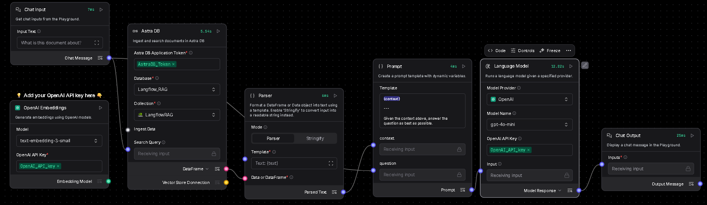
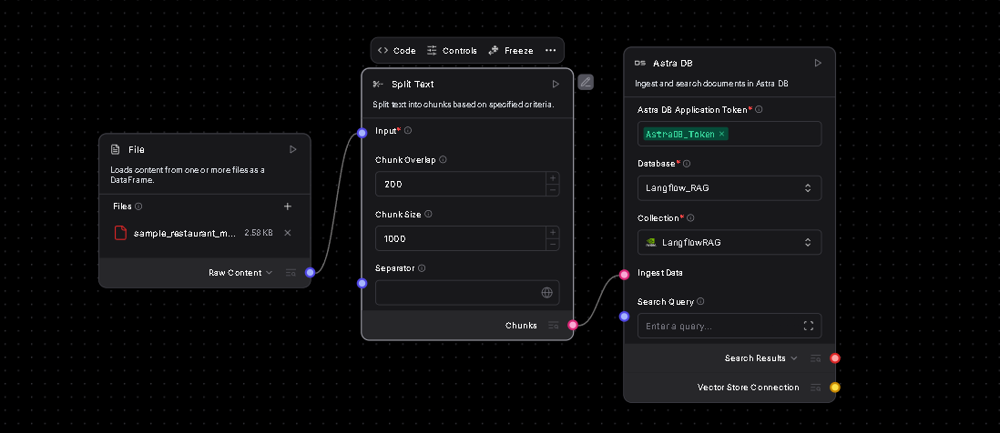
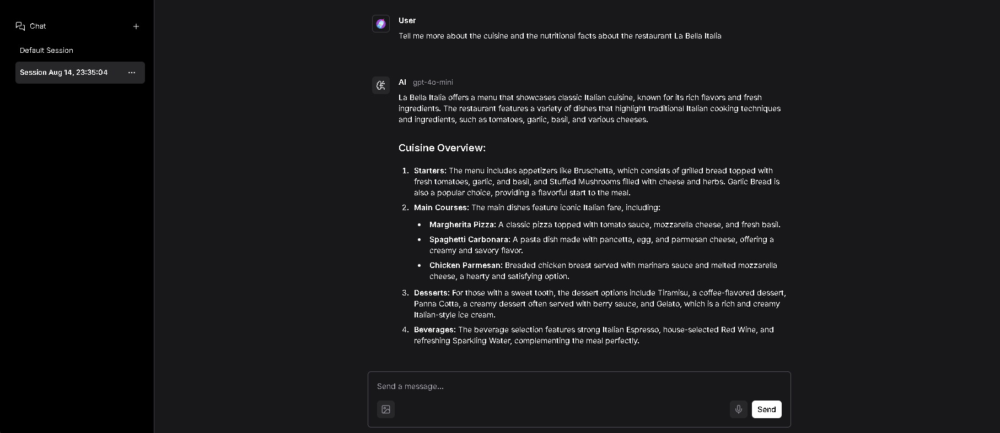

# Langflow RAG Chatbot (AstraDB)

A local-first **Retrieval-Augmented Generation (RAG)** chatbot built with **Langflow**. Documents are chunked, embedded, and stored in **AstraDB** for fast semantic search; answers are generated by an LLM (default: OpenAI) with inline source citations.

> **Stack:** Langflow UI · OpenAI (LLM + embeddings) · AstraDB (Vector DB) · Python 3.13 · `uv` + `venv`

---

## ✨ Features
- **No-code/low-code** orchestration with **Langflow** (drag-and-drop flow editor)
- **AstraDB** vector store for scalable, persistent retrieval
- **Local docs ingestion** (PDF/Markdown/Docx/HTML, etc.)
- **Configurable chunking** (size/overlap), top‑k, and prompts
- **Re-usable flows**: export/import as JSON

---

## 📦 Repo Layout
```
.
├─ data/                     # Put your source docs here (ingestion via Langflow)
├─ flows/                    # Exported Langflow flows (JSON)
│  └─ rag_astradb.json       # Example flow (import into Langflow)
├─ .env.example              # Copy to .env and fill in your keys
└─ README.md
```

---

## 🚀 Quickstart

### 0) Prereqs
- **Python**: 3.13+ (3.11+ also fine)
- **VS Code** or terminal
- **AstraDB**: a Serverless DB with **Data API** enabled
  - Create a **Token** ("Application Token")
  - Note your **API Endpoint** (e.g., `https://<db-id>-<region>.apps.astra.datastax.com`)
  - Keyspace (namespace), e.g., `default_keyspace`
- **OpenAI API key** (or switch the LLM node to your provider)

### 1) Virtual env
```powershell
# Windows / PowerShell
py -3.13 -m venv langflow-env          # create
.\langflow-env\Scripts\activate        # activate
```
> Use `Set-ExecutionPolicy RemoteSigned -Scope CurrentUser` if activation is blocked.

### 2) Install Langflow + Astra client
```powershell
pip install uv                          # CLI wrapper (fast package installs)
uv pip install langflow astrapy         # astrapy = Astra DB Data API client
```

### 3) Configure environment
Create `.env` (or set env vars in your shell):
```env
# LLM (defaults use OpenAI)
OPENAI_API_KEY=sk-...

# AstraDB (Data API)
ASTRA_DB_API_ENDPOINT=https://<db-id>-<region>.apps.astra.datastax.com
ASTRA_DB_APPLICATION_TOKEN= AstraCS:...
ASTRA_DB_KEYSPACE=default_keyspace      # aka namespace
ASTRA_DB_COLLECTION=rag_documents       # collection to store vectors

# Embeddings: ensure collection vector dimension matches your model
# text-embedding-3-small -> 1536, text-embedding-3-large -> 3072
EMBEDDING_MODEL=text-embedding-3-small
```
> **Important:** Create the AstraDB collection so its **vector dimension** matches your embedding model (e.g., 1536 for `text-embedding-3-small`). If you create from UI/SDK, set the dimension accordingly.

### 4) Run Langflow
```powershell
uv run langflow run --host 127.0.0.1 --port 7860
```
Open **http://127.0.0.1:7860** in your browser.

### 5) Import the example flow
- In the Langflow UI, click **Import** (folder icon) → select `flows/rag_astradb.json` (or your own export)
- Update node fields if needed (API keys, Astra endpoint, collection name)

---

## 🧩 Building the RAG Flow in Langflow
A typical graph (all nodes available in Langflow):

```
[File Loader] → [Text Splitter] → [Embeddings]
                              ↘
                      [AstraDB Vector Store] ← (persist)

[Query Input] → [Retriever (AstraDB)] → [Prompt Template] → [LLM] → [Answer]
                                      ↘ [Citations]
```

**Two‑flow architecture used in this repo**
- **Ingestion Flow (Vector DB)**: Load files → split into chunks (`size=1000`, `overlap=200`) → embed (`text-embedding-3-small`) → upsert into **AstraDB** (Database: `Langflow_RAG`, Collection: `LangflowRAG`). See the *Vector Database Ingestion Flow* screenshot.
- **RAG Chat Flow (LLM)**: Take user question → retrieve top‑k from **AstraDB** → assemble a prompt with `{context}` and `{question}` → call **OpenAI** `gpt-4o-mini` → display answer in Chat Output. See the *LLM RAG Workflow* screenshot.

**Key nodes & tips**
- **File Loader**: point to `./data` to ingest docs
- **Text Splitter**: start with `chunk_size=800–1000`, `overlap=200`
- **Embeddings**: `text-embedding-3-small` (1536 dims)
- **AstraDB Vector Store**: set Endpoint, Token, Keyspace, Collection
- **Retriever**: `top_k=5` default
- **LLM**: `gpt-4o-mini` (set `OPENAI_API_KEY`)
- **Answer Template**: instruct to answer in Markdown and include sources

## 💾 Save & Restore Flows
- **Export**: In Langflow UI → ⋮ (top-right) → **Export** → save JSON to `flows/your_flow.json`
- **Import**: Click **Import** (folder icon) → select the JSON to restore the flow

---

## 🧪 Usage
1) Drop PDFs/MD/DOCX into `./data`
2) In Langflow, click **Run** on the ingestion subgraph (Loader → Splitter → Embeddings → AstraDB)
3) Ask questions in the **Chat** pane; answers include citations from retrieved chunks

---

## 🔧 Configuration
- **Retrieval**: `top_k=5` (tune 3–10)
- **Similarity metric**: cosine (AstraDB default for vectors)
- **Hybrid search**: optional (BM25 + vector); if needed, add a keyword retriever and merge
- **Reranking**: optional (e.g., cross-encoder) if you want higher precision on long answers

---

## ▶️ Start / Stop
```powershell
# Start (from repo root, with venv activated)
uv run langflow run --host 127.0.0.1 --port 7860

# Stop
Ctrl + C
```
> If port 7860 is busy, use `--port 7861` (or any free port).

---

## 🔁 Upgrade
```powershell
uv pip install -U langflow astrapy
```

---

## 🧯 Troubleshooting
- **Activation blocked on Windows**: `Set-ExecutionPolicy RemoteSigned -Scope CurrentUser`
- **Langflow command not found**: ensure you’re inside the venv and `langflow` is installed (`pip show langflow`)
- **Astra auth errors**: verify `ASTRA_DB_API_ENDPOINT` and `ASTRA_DB_APPLICATION_TOKEN` (use Data API endpoint, not REST)
- **Vector dimension mismatch**: make sure collection vector dimension equals the embeddings model dimension (e.g., 1536)
- **Rate limits**: reduce `top_k`, use smaller models, or add retry/backoff in nodes (Langflow supports retries)

---

## 🔐 Environment & Secrets
- Don’t commit `.env`—use `.env.example` and Git ignore
- In CI or hosted deployments, set secrets via platform secret managers

**`.env.example`**
```env
OPENAI_API_KEY=
ASTRA_DB_API_ENDPOINT=
ASTRA_DB_APPLICATION_TOKEN=
ASTRA_DB_KEYSPACE=default_keyspace
ASTRA_DB_COLLECTION=rag_documents
EMBEDDING_MODEL=text-embedding-3-small
```

---

## 📸 Screenshots & Flow Diagrams
To include images on GitHub, place them in an `assets/` folder at the repo root and use these filenames:

1) **LLM RAG Workflow** (retrieval + prompt + LLM)



_Key settings visible in the graph:_ OpenAI Embeddings = `text-embedding-3-small` (1536 dims); Prompt uses `{context}` + `{question}`; LLM = `gpt-4o-mini`; answers flow to Chat Output.

2) **Vector Database Ingestion Flow** (file → splitter → AstraDB)



_Key settings visible in the graph:_ File Loader ingests `sample_restaurant_menu.pdf`; Split Text with `chunk_size=1000`, `overlap=200`; AstraDB node configured with Application Token, Database = `Langflow_RAG`, Collection = `LangflowRAG`.

3) **Chat UI** (end‑to‑end result)



_Example prompt/answer showing structured response and bullet formatting._

> 📌 If you keep these exact filenames, the README will render the images automatically. Otherwise, update the paths above.

## 🗺️ Roadmap
- [ ] **Dockerize**: Add `Dockerfile` + `docker-compose.yml` for one‑command startup (Langflow + Astra env vars).
- [ ] **CLI Ingestion**: Small Python script to batch‑ingest `./data` outside the UI; verify vector dimension vs. embedding model.
- [ ] **Eval Suite**: Add RAGAS or simple Q/A regression set with accuracy/citation metrics; seed dataset for menus/docs.
- [ ] **Telemetry**: Optional integration with Langfuse or MLflow for prompt, latency, and cost tracking.
- [ ] **Hybrid Search**: BM25 + vector retriever with score fusion; toggle via env.
- [ ] **Reranker**: Optional cross‑encoder reranker node for higher precision on longer answers.
- [ ] **Caching**: Add in‑memory or Redis response cache keyed by normalized query + index version.
- [ ] **Multi‑env Config**: `.env.dev` / `.env.prod`, secrets guidance, and Astra collection lifecycle (dev vs prod).
- [ ] **CI**: GitHub Actions for lint, type check, and basic flow import test.
- [ ] **Providers**: Add Azure OpenAI / Anthropic / local (Ollama) variants of the flow.
- [ ] **Frontend**: (Optional) add a minimal Next.js chat UI that talks to Langflow’s API.
- [ ] **Security**: Document PII handling and optional content filters/guardrails in the prompt.

## 📄 License
MIT

---

## 🙌 Acknowledgements
- **Langflow** for the excellent flow builder
- **DataStax AstraDB** for a managed, serverless vector database
- **OpenAI** for LLMs and embeddings

